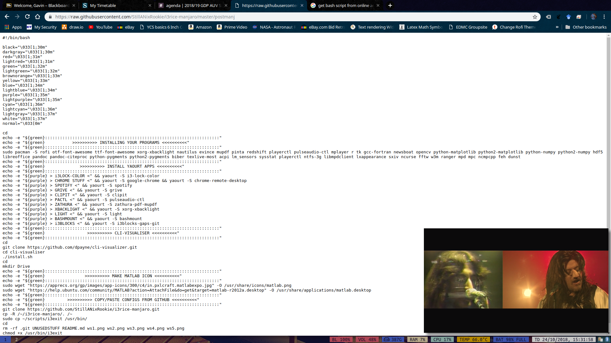
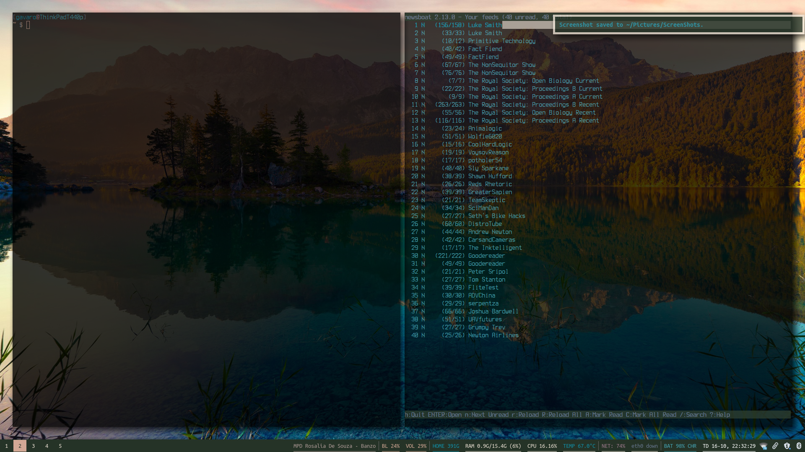
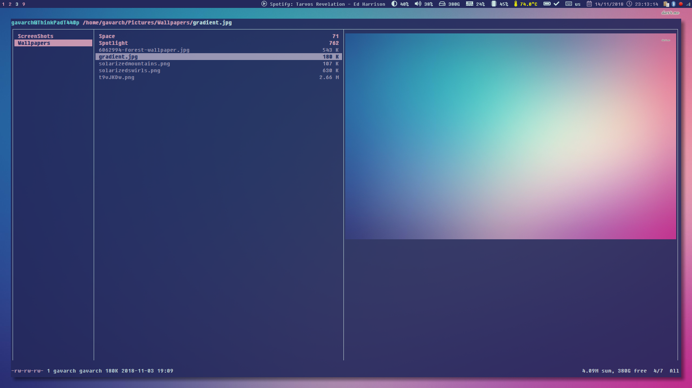
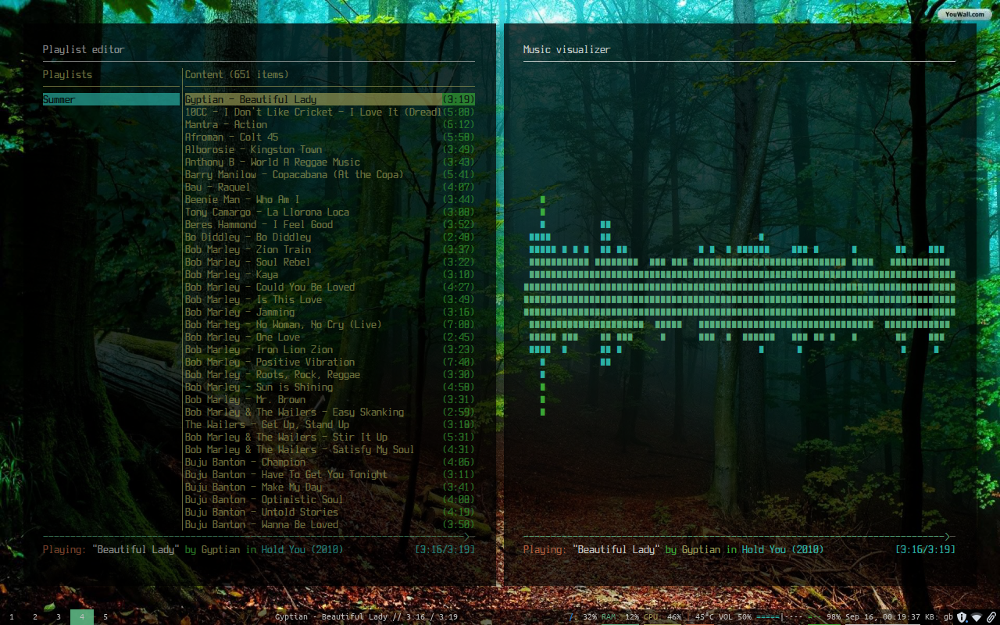
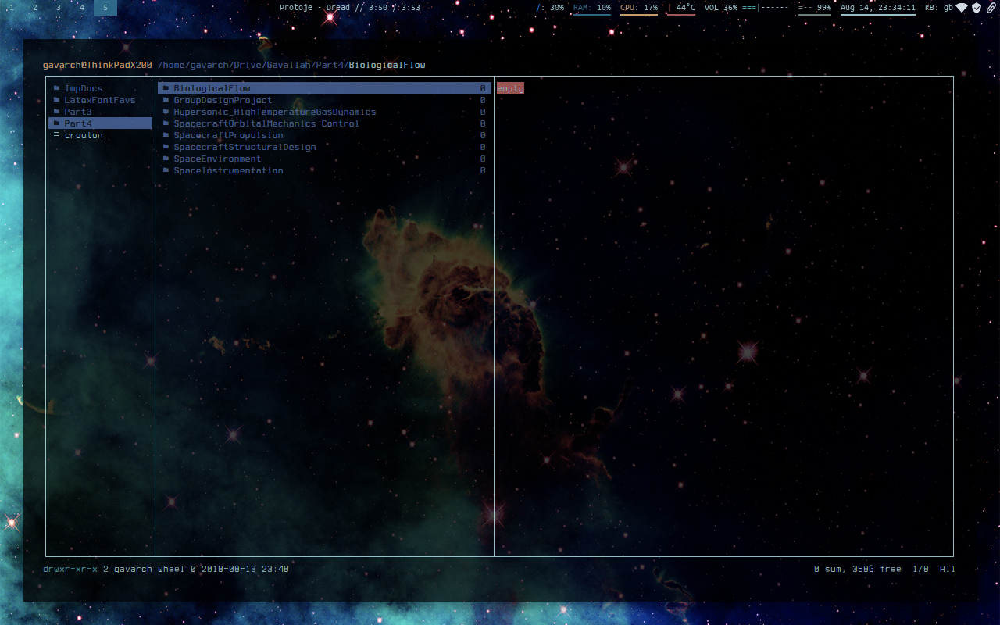

# Scrots











# First

Install these packages...

```
sudo pacman -S rofi qutebrowser ttf-font-awesome nitrogen xorg-xbacklight nautilus evince mupdf pinta redshift playerctl pulseaudio-ctl mplayer R opencv python-matplotlib python2-matplotlib python-numpy python2-numpy hdf5 libreoffice
```

These for R...

```
install.packages{"rmarkdown"}
install.packages{"reticulate"}
```

These for markdown to pdf...

```
sudo pacman -S pandoc pandoc-citeproc
```

And these for LaTex...

```
sudo pacman -S python-pygments python2-pygments biber texlive-most
```

# Second

Install these from the AUR using the software manager:

```
i3blocks-gaps-git rxvt-unicode-pixbuf chromium-widevine i3lock-color-git polybar touchegg-git spotify grive mpris-ctl

```

# Third

Install cli-visualizer from [here](https://github.com/dpayne/cli-visualizer)

# Fourth

Copy-paste `i3exit` to `/usr/bin`

# Fifth

Make a Matlab desktop icon:

```
sudo wget  https://apprecs.org/gp/images/app-icons/300/c4/in.pxlcraft.matlabexpo.jpg -O /usr/share/icons/matlab.png
sudo wget 'https://help.ubuntu.com/community/MATLAB?action=AttachFile&do=get&target=matlab-r2012a.desktop' -O /usr/share/applications/matlab.desktop
```

# Sixth

Just copy-paste the rest of the configs from this repo!
