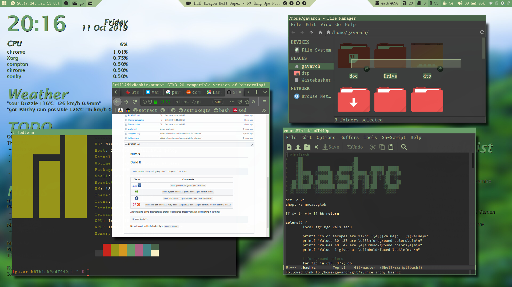
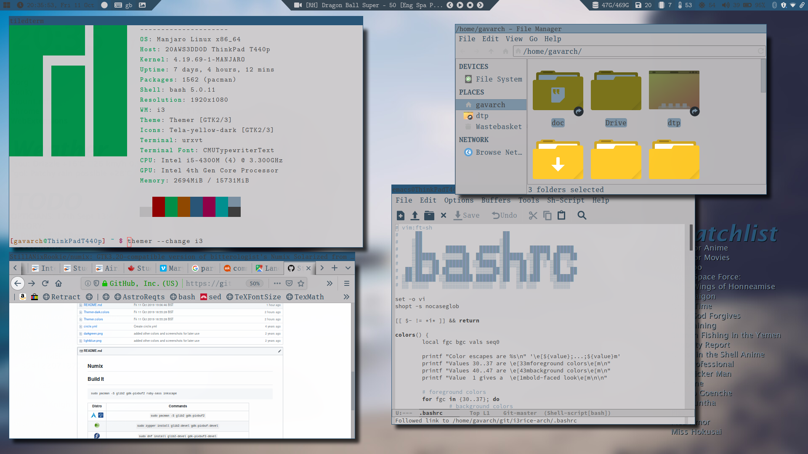
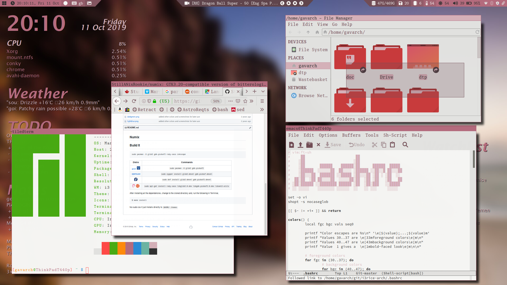
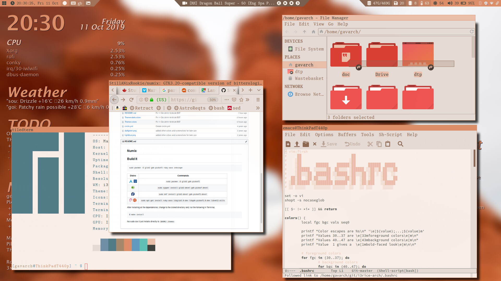
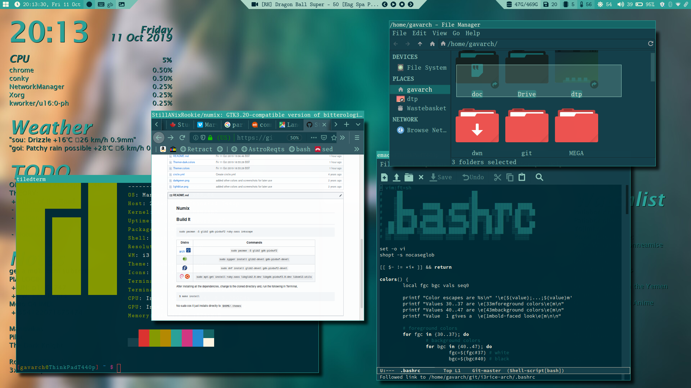
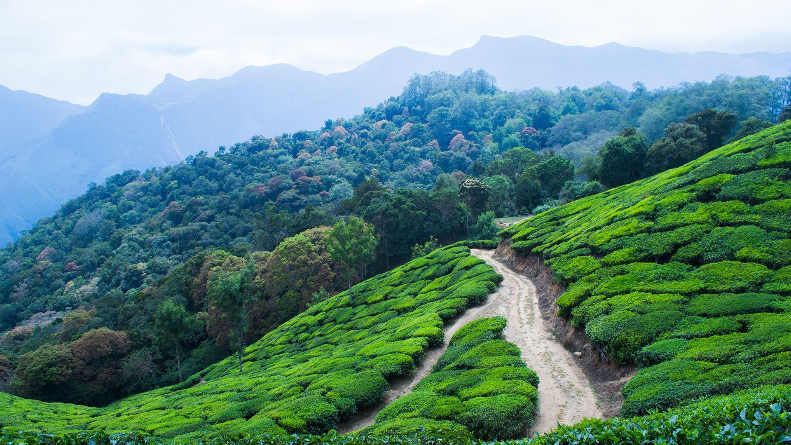
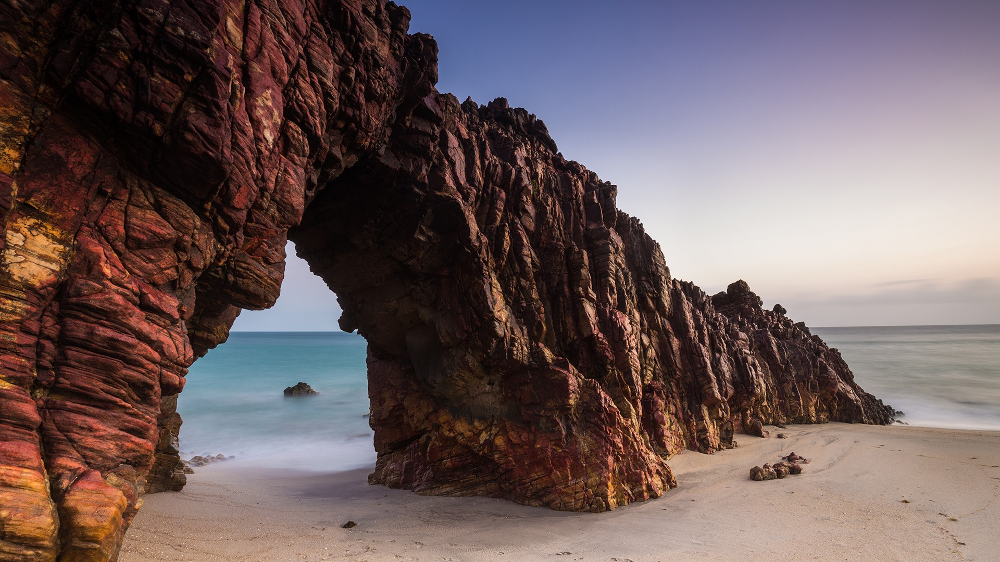
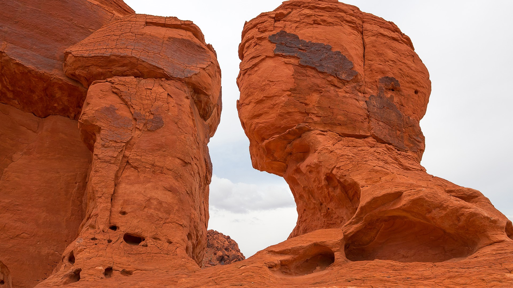

[](https://stars.medv.io/StillANixRookie/i3rice-arch)

# Main Install

First check UEFI:

```
ls /sys/firmware/efi/efivars
```

Connect to internet via ethernet or ```wifi-menu```.

Run ```timedatectl set-ntp true```.

Partition drive using fdisk or gdisk.

+ For GPT: BOOT, ROOT, SWAP, HOME
+ For MBR: BOOT, SWAP, ROOT, HOME

Make filesystems:

+ ```mkfs.ext4 /dev/sd**``` for BOOT, ROOT & HOME
+ ```mkswap /dev/sd**``` for SWAP, then ```swapon /dev/sd**```

Mount filesystems:

+ ```mount /dev/sdROOT /mnt```
+ ```mkdir boot```
+ ```mkdir home```
+ ```mount /dev/sdBOOT /mnt/boot```
+ ```mount /dev/sdHOME /mnt/home```

Install Arch:

+ ```pacstrap /mnt base base-devel git wget vim```

Make ```/etc/fstab```:

```
genfstab -U /mnt >> /mnt/etc/fstab
```

Install GRUB:

+ First ```arch-chroot /mnt```
+ ```pacman -S grub```
+ ```grub-install --target=i386-pc /dev/sdDRIVE```
+ ```grub-mkconfig -o /boot/grub/grub.cfg```

Generate locale:

+ ```vim /etc/locale.gen```
+ Uncomment your locale
+ Run ```locale-gen```
+ ```echo LANG=en_GB.UTF-8 >> /etc/locale.conf```
+ ```ln -sf /usr/share/zoneinfo/GMT /etc/localtime```

Hostname & Password

+ ```echo HOSTNAME /etc/hostname```
+ ```passwd```

Add User & User Password:

+ ```useradd -m -g wheel gavarch```
+ ```passwd gavarch```

Then...

+ ```cd /etc```
+ ```rm sudoers```
+ ```wget https://raw.githubusercontent.com/StillANixRookie/i3rice-arch/master/sudoers```

Now you should just have to exit the chroot, ```umount -R``` your arch drive, and then reboot and login with your username. For installing apps and configs, do the following, and then reboot and login again, and everything should be fine ```:)```.

+ ```cd /home/gavarch```
+ ```wget https://raw.githubusercontent.com/StillANixRookie/i3rice-arch/master/postarch```
+ ```bash postarch```
# Walls











# Scrots









